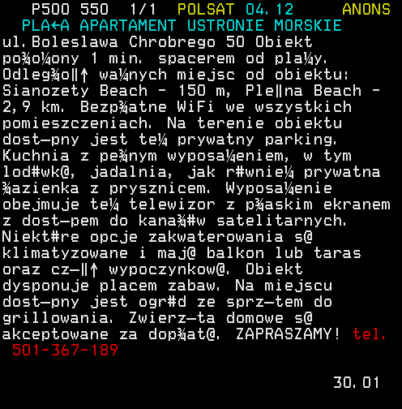
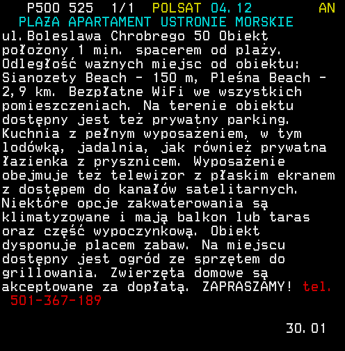

# Teletext Polish Characters Converter
This piece of software converts all English characters from teletext streams produced by [vhs-teletext](https://github.com/ali1234/vhs-teletext to Polish ones.

# Usage

## Live (interactive)
The converter can be used on top of `teletext interactive` to filter all characters.

## Example
```bash
teletext service <file> | teletext interactive | java -jar teletext-pl-character-converter.jar live
```

## Result

**Without filtering**


**With filtering**


# HTML
You can also convert HTML files generated with `teletext html`.

```bash
java -jar teletext-pl-character-converter.jar parse <HTML dir>
```